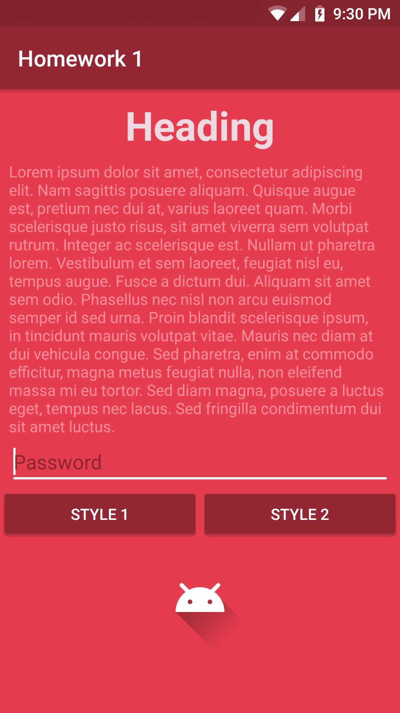

# Homework 7

1. Finish `AppTheme1`, so it matches provided screenshot
2. Prepare `AppTheme2` according to your liking and taste -> amaze us ;)
3. Make sure all checks are passing
4. All code logic doesn't have to be in `app_theme1.xml` or `app_theme2.xml`
   * some attributes are not part of style definition, but the layout file
   * edit only `app/src/main/res/layout/activity_main.xml`, `app/src/main/res/values/app_theme1.xml`, `app/src/main/res/values/app_theme2.xml`, `app/src/main/res/values/colors.xml`, and `app/src/main/res/values/dimens.xml`
5. Proceed with push request as described in [wiki](https://gitlab.fi.muni.cz/grp-pv256/wiki/wikis/home)
   * don't forget to share it with **xsevci11**, **ext-stefan.krajanec**, **xpanek1**, **xmasa**

## AppTheme1

